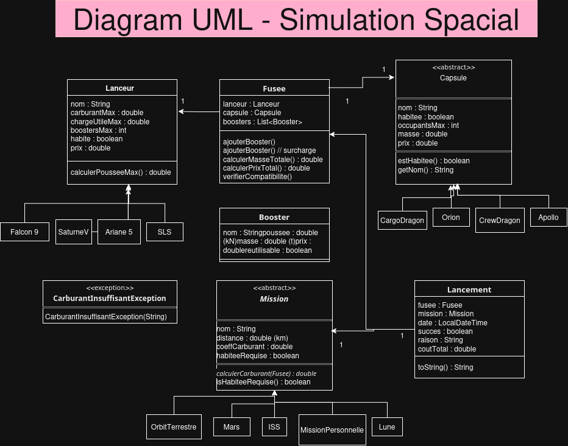

<div align="center">

# SimulateurSpacial

### Simulateur de lancement spatial en Java : ligne de commande

[](https://openjdk.org/)
[-lightgrey?style=for-the-badge)]()
[]()
[](LICENSE)

[Fonctionnalités](#fonctionnalités) • [Démarrage rapide](#démarrage-rapide) • [Missions](#missions) • [Architecture](#architecture)

</div>

---

## Fonctionnalités

<table>
<tr>
<td width="50%">

### Construction de la fusée
- **Lanceurs** : Choix entre SLS, Saturne V, Ariane 5, Falcon 9
- **Capsules** : Orion, Crew Dragon, Cargo Dragon, Apollo
- **Boosters** : SRB, EAP, BE3 : quantité configurable selon le lanceur
- **Validation automatique** : compatibilité équipage / capsule vérifiée avant le lancement

</td>
<td width="50%">

### Simulation & Résultats
- **5 missions disponibles** : de l'orbite terrestre jusqu'à Mars
- **Calcul de carburant** : formule basée sur la masse totale et la distance
- **Calcul de coût** : prix fusée + kérosène (par tonne)
- **5% de probabilité d'échec** : anomalie technique aléatoire

</td>
</tr>
<tr>
<td>

### Historique
- **Sauvegarde automatique** : chaque lancement est écrit dans `history.txt`
- **Consultation en direct** : historique affichable depuis le menu principal
- **Détail complet** : fusée, mission, succès/échec, coût total

</td>
<td>

### Robustesse
- **Validation des entrées** : `InputHelper` gère les saisies invalides sans planter
- **Exceptions métier** : `FuelInsufficient` pour les calculs de carburant
- **Constructeurs stricts** : `IllegalArgumentException` sur toute valeur incohérente

</td>
</tr>
</table>

---

## Démarrage rapide

### Prérequis
- Java 17 ou supérieur
- Git

### Compilation & lancement

```bash
# Cloner le dépôt
git clone <url-du-repo>
cd SimulationSpacial

# Option 1 : script 
bash run.sh

# Option 2 : manuellement
find src -name "*.java" | xargs javac -d out -sourcepath src
java -cp out Main
```

### Exemple de session

```
1. Choose launcher
2. Choose capsule
3. Choose boosters
4. Choose mission
5. Launch
6. Show history
7. Exit

Your choice : 1
  1. SLS          | Fuel: 2600t | Payload: 130t | Boosters: 2 | Crewed: true  | Price: 2000 M€
  2. Saturne V    | Fuel: 2700t | Payload: 140t | Boosters: 0 | Crewed: true  | Price: 1500 M€
  3. Ariane 5     | Fuel: 700t  | Payload: 20t  | Boosters: 2 | Crewed: false | Price: 180 M€
  4. Falcon 9     | Fuel: 500t  | Payload: 20t  | Boosters: 0 | Crewed: true  | Price: 60 M€
```

---

## Missions

| Mission | Distance | Équipage requis | Notes |
|---------|----------|-----------------|-------|
| **Orbite Terrestre** | 400 km | Non | Mission cargo, pas besoin d'équipage |
| **ISS** | 400 km | OK | Station spatiale internationale |
| **Lune** | 400 000 km | OK | Programme lunaire habité |
| **Point de Lagrange L2** | 1 500 000 km | Non | Missions d'observation, type JWST |
| **Mars** | 225 000 000 km | OK | La plus gourmande en carburant |

---

## Formules de simulation

<div align="center">

| Calcul | Formule |
|--------|---------|
| **Carburant requis** | `(masse_totale × distance × coefficient_carburant) / 1000` |
| **Coût total** | `prix_fusée + (carburant × 1 200 €/tonne)` |
| **Prix fusée** | `lanceur + capsule + Σ boosters` |

</div>
---

## Architecture

### Diagramme UML

<div align="center">



</div>

### Structure des fichiers

```
SimulationSpacial/
├── Main.java                       → Point d'entrée
├── run.sh                          → Script de compilation + lancement
├── history.txt                     → Historique des lancements (généré à l'exécution)
└── src/
    ├── launchers/
    │   ├── Launcher.java           → Classe abstraite (nom, carburant, charge utile, boosters...)
    │   ├── Ariane5.java
    │   ├── Falcon9.java
    │   ├── SaturneV.java
    │   └── SLS.java
    ├── capsules/
    │   ├── Capsule.java            → Classe abstraite (équipage, occupants, masse, prix)
    │   ├── Apollo.java
    │   ├── CargoDragon.java
    │   ├── CrewDragon.java
    │   └── Orion.java
    ├── booster/
    │   ├── Booster.java            → Classe de base (poussée, masse, prix)
    │   ├── BE3.java
    │   ├── EAP.java
    │   └── SRB.java
    ├── missions/
    │   ├── Mission.java            → Classe abstraite + calcul de carburant
    │   ├── ISS.java
    │   ├── Lune.java
    │   ├── Mars.java
    │   ├── OrbitTerrestre.java
    │   └── PointLagrangeL2.java
    ├── models/
    │   ├── Rocket.java             → Assemblage lanceur + capsule + boosters
    │   └── Launch.java             → Résultat d'un lancement (succès, coût, raison)
    ├── services/
    │   ├── SimulatorApp.java       → Singleton : menu principal et flux utilisateur
    │   ├── Simulator.java          → Logique de simulation et calcul de coût
    │   ├── HistoryService.java     → Écriture de l'historique dans history.txt
    │   └── InputHelper.java        → Lecture et validation des saisies clavier
    └── exceptions/
        └── FuelInsufficient.java   → Exception levée quand le carburant manque
```

---

## Lanceurs disponibles

<div align="center">

| Lanceur | Carburant max | Charge utile | Boosters max | Équipage | Prix |
|---------|--------------|--------------|--------------|----------|------|
| **SLS** | 2 600 t | 130 t | 2 | OK | 2 000 M€ |
| **Saturne V** | 2 700 t | 140 t | 0 | OK | 1 500 M€ |
| **Ariane 5** | 700 t | 20 t | 2 | Non | 180 M€ |
| **Falcon 9** | 500 t | 20 t | 0 | OK | 60 M€ |

</div>

---

<div align="center">

By Mathys P.K
</div>

---

## Déclaration IA

Dans le cadre de ce projet, j'ai utilisé Claude de plusieurs façons :

- **Gestion de projet** : Claude m'a aidé à structurer et rédiger mon espace Notion pour organiser le projet (suivi des tâches, documentation, planning).
- **Design du README** : Claude a contribué à la mise en forme et à la structure de ce fichier README (badges, tableaux, sections).
- **Apprentissage des notions techniques** : Avant de me lancer dans le développement, j'ai posé de nombreuses questions à Claude sur les termes et concepts techniques que je devais maîtriser en me refaisant un cours structuré que je pouvais réutiliser n'importe quand sur classes abstraites, exceptions, design patterns, l'héritage, l'encapsulation, formules de simulation ... afin de bien comprendre les notions avant de les implémenter.
